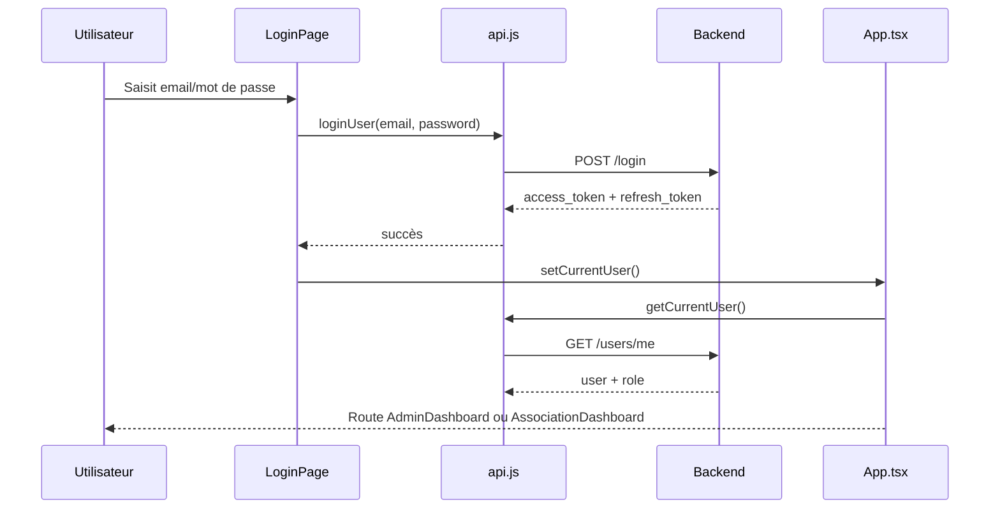
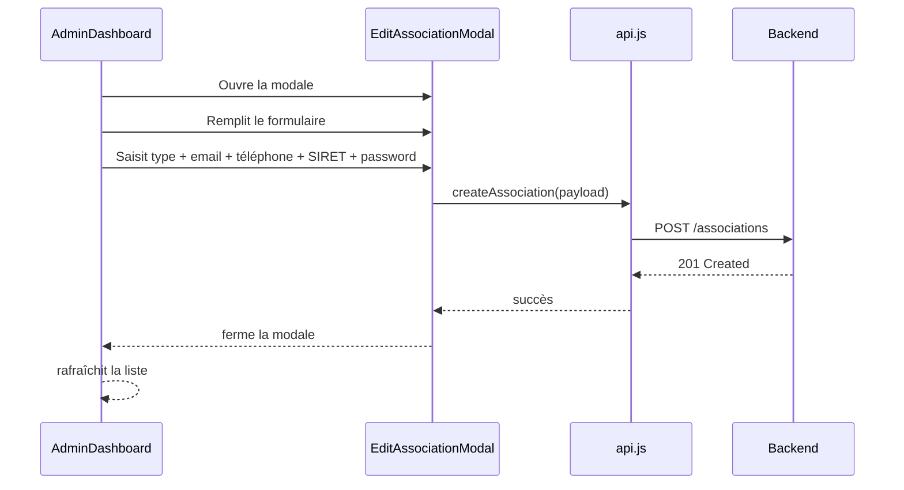
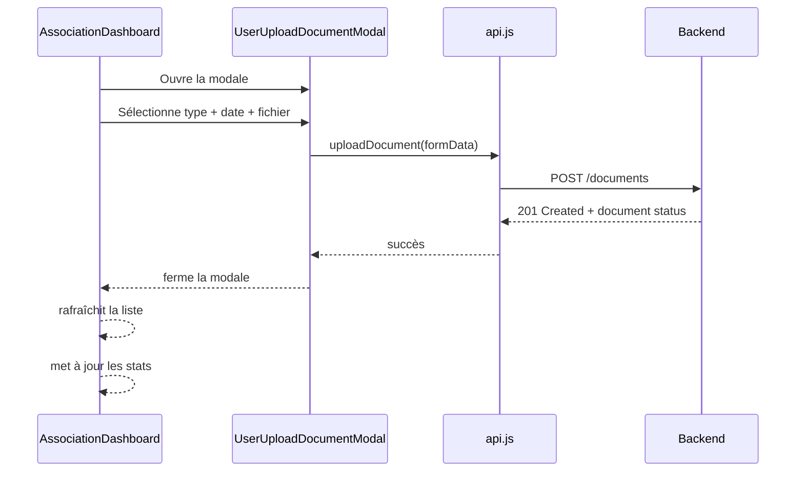

# Architecture Frontend - Gestion Vie Associative

## Vue d'ensemble

Le frontend est une application React en TypeScript utilisant Vite comme bundler. Elle gère l'authentification et deux interfaces distinctes : une pour les administrateurs et une pour les responsables d'associations.

## Structure du projet

```
frontend/src/
├── App.tsx                          # Point d'entrée principal (routing)
├── main.tsx                         # Bootstrap React
├── api.js                           # Client HTTP (Axios) + endpoints API
├── hooks.js                         # Custom hooks React
├── index.css                        # Styles globaux
├── components/
│   ├── LoginPage.tsx               # Page de connexion
│   ├── ResetPasswordPage.tsx        # Page de réinitialisation mot de passe
│   ├── AdminDashboard.tsx           # Dashboard admin (parent)
│   ├── AssociationDashboard.tsx     # Dashboard utilisateur (parent)
│   ├── admin/
│   │   ├── AssociationDetailView.tsx    # Détail d'une association (tabs)
│   │   ├── AssociationsList.tsx         # Liste des associations
│   │   ├── DocumentsList.tsx            # Liste des documents globale
│   │   ├── StatsOverview.tsx            # Vue d'ensemble statistiques
│   │   ├── MandatsManager.tsx           # Gestion des mandats
│   │   ├── SettingsPanel.tsx            # Paramètres système (types, rôles)
│   │   ├── tabs/
│   │   │   ├── OverviewTab.tsx          # Onglet aperçu association
│   │   │   ├── DocumentsTab.tsx         # Onglet documents
│   │   │   └── LeadersTab.tsx           # Onglet mandats/leaders
│   │   └── modals/
│   │       ├── UploadDocumentModal.tsx  # Upload document (admin)
│   │       └── EditAssociationModal.tsx # Édition association (admin)
│   ├── shared/
│   │   ├── DocumentStatusBadge.tsx      # Composant badge statut document
│   │   └── modals/
│   │       ├── UserUploadDocumentModal.tsx     # Upload document (user)
│   │       ├── UserEditAssociationModal.tsx    # Édition association (user)
│   │       └── UserSettingsModal.tsx           # Paramètres utilisateur
│   ├── figma/
│   │   └── ImageWithFallback.tsx        # Composant image avec fallback
│   └── ui/
│       └── [composants shadcn/ui]       # UI library (inputs, dialogs, etc.)
└── styles/
    └── globals.css                  # Styles Tailwind
```

## Architecture des composants

### Hiérarchie de rendu

```
App (App.tsx)
│
├─ Router / Routes
│
├─ LoginPage
├─ AdminDashboard
│   ├─ Sidebar
│   ├─ StatsOverview
│   │   └─ PresidentChangeAlerts (notifications prioritaires)
│   ├─ AssociationsList
│   │   └─ AssociationDetailView
│   │       ├─ OverviewTab
│   │       ├─ DocumentsTab
│   │       └─ LeadersTab
│   ├─ DocumentsList
│   ├─ SettingsPanel
│   └─ Modals
│       ├─ UploadDocumentModal
│       └─ EditAssociationModal
│
└─ AssociationDashboard
    ├─ Header (email + settings)
    ├─ PresidentChangeAlerts (notifications prioritaires)
    ├─ Tabs (overview, documents, leaders)
    └─ Modals
        ├─ UserUploadDocumentModal
        ├─ UserEditAssociationModal
        └─ UserSettingsModal
```

### Flux de données

```
Composants UI
   ↓
api.js (Axios)
   ├─ Authentication
   │   ├─ loginUser()
   │   ├─ getCurrentUser()
   │   ├─ logout()
   │   └─ resetPassword()
   ├─ Associations
   │   ├─ getAssociations()
   │   ├─ getAssociationDetails()
   │   ├─ createAssociation()
   │   └─ updateAssociation()
   ├─ Documents
   │   ├─ getDocuments()
   │   ├─ uploadDocument()
   │   ├─ approveDocument()
   │   ├─ rejectDocument()
   │   └─ updateDocument()
   ├─ Membres
   │   ├─ getAssociationMembers()
   │   └─ createMembre()
   ├─ Mandats
   │   ├─ getAssociationMandats()
   │   ├─ createMandat()
   │   └─ deleteMandat()
   ├─ Notifications
   │   ├─ getUnreadNotifications()
   │   └─ markNotificationsAsRead()
   └─ User Profile
       ├─ updateUserProfile()
       └─ changeUserPassword()
```

## Types de composants

### 1. **Composants de page (Pages)**
- `LoginPage.tsx` - Formulaire de connexion
- `AdminDashboard.tsx` - Dashboard principal admin
- `AssociationDashboard.tsx` - Dashboard principal utilisateur
- `ResetPasswordPage.tsx` - Réinitialisation mot de passe

### 2. **Composants de conteneur (Containers)**
- `AssociationDetailView.tsx` - Conteneur pour détail association
- `StatsOverview.tsx` - Conteneur pour statistiques
- `AssociationsList.tsx` - Conteneur pour liste associations
- `DocumentsList.tsx` - Conteneur pour liste documents

### 3. **Composants d'onglets (Tabs)**
- `OverviewTab.tsx` - Aperçu association (stats, infos, membres)
- `DocumentsTab.tsx` - Gestion documents
- `LeadersTab.tsx` - Gestion mandats/leaders

### 4. **Composants de modale (Modals)**
- **Admin modals:**
  - `UploadDocumentModal.tsx` - Upload document
  - `EditAssociationModal.tsx` - Édition association
- **User/Shared modals:**
  - `UserUploadDocumentModal.tsx` - Upload document (user)
  - `UserEditAssociationModal.tsx` - Édition association (user)
  - `UserSettingsModal.tsx` - Paramètres utilisateur (email/password)

### 5. **Composants de notifications (Notifications)**
- `PresidentChangeAlerts.tsx` - Affichage des notifications avec tri par priorité
  - Tri automatique : error > warning > success > info
  - Auto-refresh toutes les 30 secondes
  - Bouton Masquer/Afficher pour contrôler la visibilité
  - Boutons individuels pour marquer comme lus
  - Réactualisation automatique si notification supprimée prématurément

### 6. **Composants utilitaires (Utils)**
- `DocumentStatusBadge.tsx` - Badge statut document
- `ImageWithFallback.tsx` - Image avec fallback

### 7. **Composants UI (UI Library)**
- Shadcn/ui components (Button, Input, Dialog, Tabs, etc.)
- Icones lucide-react (Bell, CheckCircle2, AlertCircle, Info, ChevronDown, ChevronUp, etc.)

## Flux d'authentification



## Gestion d'état

### État global (App.tsx)
- `currentUser` - Utilisateur connecté
- `loading` - État de chargement initial

### État local (par composant)
- Chaque page/conteneur gère son propre état
- Les modals gèrent leur propre formulaire

### Persistance
- Tokens JWT stockés dans `localStorage`
- Refonte automatique via intercepteur Axios

## Patterns utilisés

### 1. **Custom Hooks**
- `useAuth()` - Gestion authentification (hooks.js)

### 2. **Composants contrôlés**
- Les formulaires utilisent `useState` pour chaque champ
- Validation côté client avant envoi API

### 3. **Composition**
- Les composants parents passent les données par props
- Les enfants remontent les événements par callbacks

### 4. **Conditionnels**
- Affichage basé sur le rôle (admin vs user)
- Affichage basé sur l'état des données

## Stylisation

- **Tailwind CSS** - Framework CSS utilitaire
- **Tailwind plugins** - Border radius, spacing custom
- **Composants shadcn/ui** - Composants pré-stylisés

## Exemple de flux: Créer une association (Admin)



## Exemple de flux: Uploader un document (User)



## Système de notifications

### Architecture des notifications

Les notifications sont gérées par un système intelligent d'auto-régénération :

```
Frontend (PresidentChangeAlerts)
   ↓
GET /api/notifications/unread/
   ↓
Backend (NotificationViewSet.get_queryset())
   ├─ _ensure_expiration_notifications()
   │   └─ Documents expirant dans 60 jours
   ├─ _ensure_president_notifications()
   │   └─ Associations sans président
   └─ _ensure_mandatory_documents_notifications()
       └─ Documents obligatoires manquants
   ↓
Retour notifications (is_read=False)
   ↓
Frontend: Tri par priorité + affichage
```

### Types de notifications

| Type | Priorité | Couleur | Cas d'usage |
|------|----------|---------|------------|
| **error** | 1 (max) | 🔴 Rouge | Président manquant (alerte) |
| **warning** | 2 | 🟠 Orange | Documents expirant bientôt, documents obligatoires manquants |
| **success** | 3 | 🟢 Vert | (réservé) |
| **info** | 4 | 🔵 Bleu | (réservé) |

### Tri et affichage

- **Tri primaire** : par priorité (error > warning > success > info)
- **Tri secondaire** : par date (plus récent en premier)
- **Affichage** : 3 notifications visibles, bouton "Voir plus" si > 3
- **Contrôle de visibilité** : Bouton "Masquer/Afficher" pour collaber le bloc
- **Compteur** : Badge affichant le nombre total (toujours visible)

### Auto-régénération

Les notifications sont **jamais supprimées** mais **recréées automatiquement** si :

1. **Condition toujours vraie** : Notification recréée avec `is_read=False`
2. **Notification supprimée** : Recréée au prochain appel API
3. **Notification marquée comme lue** : Réactivée si condition toujours vraie
4. **Condition résolue** : Notification marquée `is_read=True` (disparait)

**Exemple** : Vous supprimez une notification "Président manquant" sans ajouter de président → Elle se régénère au prochain appel API.

### Rafraîchissement

- **Auto-refresh** : Toutes les 30 secondes
- **Manuel** : Bouton ✓ pour marquer comme lu individuellement
- **Réactif** : Chaque action (upload document, création mandat) déclenche une vérification

## Sécurité

- **JWT Bearer Token** - Autorisation sur chaque requête
- **localStorage** - Stockage tokens (à considérer pour httpOnly cookies en production)
- **Intercepteurs Axios** - Gestion erreurs 401, refresh token
- **Validation côté client** - Email, SIRET, téléphone
- **Permissions** - Contrôlées par backend (role admin vs user)

## Performance

- **Lazy loading** - Routes React lazy loaded
- **Optimisation images** - ImageWithFallback
- **Pagination** - Listes avec pagination backend
- **Caching** - localStorage pour tokens + user info
- **Notifications** - Tri et affichage optimisés (3 visibles par défaut)